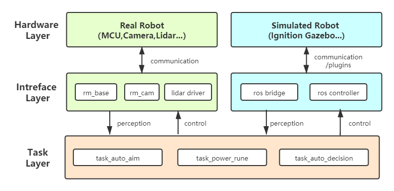

# rmoss_core

[](https://opensource.org/licenses/Apache-2.0)
[](https://github.com/robomaster-oss/rmoss_core/actions/workflows/ci_foxy.yml)


RoboMasterOSS是一个面向RoboMaster的开源软件栈项目，目的是为RoboMaster机器人软件开发提供了一个快速的，灵活的开发工具，支持算法原型研究和robomaster比赛应用开发。

> [RoboMaster竞赛](https://www.robomaster.com/)，全称为`全国大学生机器人大赛RoboMaster机甲大师赛` 。
>
> - 全国大学生机器人[RoboMaster](https://www.robomaster.com/)大赛，是一个涉及“机器视觉”、“嵌入式系统设计”、“机械控制”、“人机交互”等众多机器人相关技术学科的机器人比赛。
> - 在RoboMaster 2019赛季中，参赛队伍需自主研发不同种类和功能的机器人，在指定的比赛场地内进行战术对抗，通过操控机器人发射弹丸攻击敌方机器人和基地。每局比赛7分钟，比赛结束时，基地剩余血量高的一方获得比赛胜利。
>
> 更多详情参考官网：[www.robomaster.com](https://www.robomaster.com/)


rmoss_core是RoboMaster OSS中的基础项目，为RoboMaster提供通用基础功能模块包，如相机模块，弹道运动模块等。

* rmoss_core后续的工作方向为规范化，遵守[ROS2代码规范](https://docs.ros.org/en/galactic/Contributing/Code-Style-Language-Versions.html), 增加代码单元测试, 集成CI自动测试, 目标成为一个标准的ROS2项目, 更多开发计划详见[Roadmap](https://robomaster-oss.github.io/rmoss_tutorials/#/roadmap)

## 1.主要模块

|          模块          |                           功能说明                           |
| :--------------------: | :----------------------------------------------------------: |
|        `rm_util`       | 公共工具包: 包含调试,图像处理,ROS公共封装工具等公共基础工具。        |
|        `rm_base`       | 基本通信工具包：提供单板计算机(SBC)与嵌入式系统(MCU)通信等相关工具。 |
|        `rm_cam`        | 相机工具包：提供相机的ROS封装工具，实现usb相机，以及图片视频虚拟相机。   |
| `rm_projectile_motion` | 弹道运动工具包: 求解弹道逆运动学，由目标位置计算云台仰角  |

* rmoss项目使用ROS的坐标系标准以及基本单位标准 [REP 103](https://ros.org/reps/rep-0103.html). 

## 2.使用说明

* 目前仅支持`ROS2 foxy`版本
* 环境依赖：
  *  [rmoss_interfaces](https://github.com/robomaster-oss/rmoss_interfaces) : ROS2 interfaces (.msg, .srv, .action) used in the RoboMaster OSS Projects

环境配置

```bash
#cd ros2 workspaces src
git clone https://github.com/robomaster-oss/rmoss_interfaces.git
git clone https://github.com/robomaster-oss/rmoss_core.git
#cd ros2 workspaces
colcon build
```

* 相关功能包使用详见相应package的README.md

## 3.RMOSS 软件框架



该结构适用于RoboMaster机器人软件结构，将算法任务层与机器人硬件层进行解耦，通过Interface layer进行耦合。

* Interface Layer和Task Layer将模块化，基于ROS2进行开发，以ROS package的形式进行组织。
* 该软件框架作为RMOSS项目开发的基本软件结构，rmoss_core/rmoss_contrib/rmoss_ign等项目将遵循该模式。

主要优势如下：

* 各个模块解耦，方便模块化测试，特别是算法层不受硬件的影响，可以被方便的复用。
* 真实机器人与仿真机器人处于对等的地位，方便算法在真实机器人与仿真器上进行快速测试与迁移。


## 4.维护者及开源许可证

Maintainer : Zhenpeng Ge,  zhenpeng.ge@qq.com

rmoss_core is provided under Apache License 2.0.
