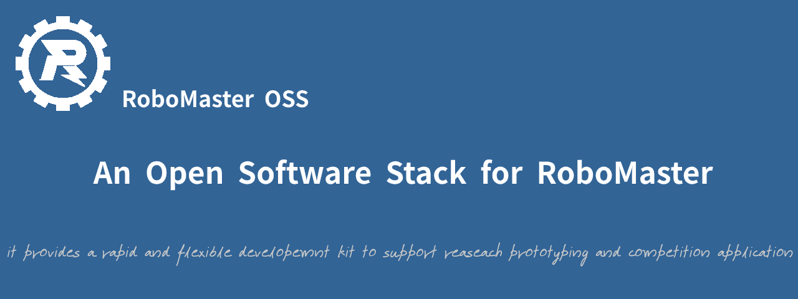

# rmoss_core

[](https://opensource.org/licenses/Apache-2.0)
[](https://github.com/robomaster-oss/rmoss_core/actions/workflows/ci.yml)
[](https://app.codacy.com/gh/robomaster-oss/rmoss_core?utm_source=github.com&utm_medium=referral&utm_content=robomaster-oss/rmoss_core&utm_campaign=Badge_Grade_Settings)


RoboMasterOSS是一个面向RoboMaster的开源软件栈项目，目的是为RoboMaster机器人软件开发提供了一个快速的，灵活的开发工具，支持算法原型研究和robomaster比赛应用开发。

> [RoboMaster竞赛](https://www.robomaster.com/)，全称为`全国大学生机器人大赛RoboMaster机甲大师赛` 。
>
> - 全国大学生机器人[RoboMaster](https://www.robomaster.com/)大赛，是一个涉及“机器视觉”、“嵌入式系统设计”、“机械控制”、“人机交互”等众多机器人相关技术学科的机器人比赛。
> - 在RoboMaster 2019赛季中，参赛队伍需自主研发不同种类和功能的机器人，在指定的比赛场地内进行战术对抗，通过操控机器人发射弹丸攻击敌方机器人和基地。每局比赛7分钟，比赛结束时，基地剩余血量高的一方获得比赛胜利。
>
> 更多详情参考官网：[www.robomaster.com](https://www.robomaster.com/)

rmoss_core是RoboMaster OSS中的基础项目，为RoboMaster提供通用基础功能模块包，如相机模块，弹道运动模块等。

## 主要模块

|          模块          |                           功能说明                           |
| :--------------------: | :----------------------------------------------------------: |
|        `rmoss_util`       | 公共工具包: 包含调试,图像处理,ROS公共封装工具等公共基础工具。   |
|     `rmoss_interfaces`    | ROS2 interface包：包含RM相关msg，srv，action定义文件        |
|        `rmoss_base`       | 基本通信工具包：提供单板计算机(SBC)与嵌入式系统(MCU)通信等相关工具。 |
|        `rmoss_cam`        | 相机工具包：提供相机的ROS封装工具，实现usb相机，以及图片视频虚拟相机。   |
| `rmoss_projectile_motion` | 弹道运动工具包: 求解弹道逆运动学，由目标位置计算云台仰角  |

* `rmoss_interfaces` : 单独仓库，作为各个ROS模块的桥梁。

## 使用说明

* ROS依赖版本：`humble`

环境配置

```bash
# cd src directory of ros2 workspaces 
git clone https://github.com/robomaster-oss/rmoss_interfaces.git -b humble
git clone https://github.com/robomaster-oss/rmoss_core.git -b humble
# cd ros2 workspaces
rosdep install -y -r -q --from-paths src --ignore-src --rosdistro humble
colcon build
```

* 相关功能包使用详见相应package的README.md

## RMOSS开发指南

* [RMOSS基本设计模式](https://robomaster-oss.github.io/rmoss_tutorials/#/design/rmoss_design): RMOSS系统架构与模块设计模式。
* [RMOSS项目规范](https://robomaster-oss.github.io/rmoss_tutorials/#/developer_guides/rmoss_project_spec): 包括代码风格，单位标准，机器人坐标系方向约定等项目规范。

`rmoss_core`后续的工作方向为规范化，遵守ROS2代码规范, 增加代码单元测试, 集成CI自动测试, 目标成为一个标准的ROS2项目, 更多开发计划详见[Roadmap](https://robomaster-oss.github.io/rmoss_tutorials/#/roadmap)

## 维护者及开源许可证

Maintainer : Zhenpeng Ge,  zhenpeng.ge@qq.com

rmoss_core is provided under Apache License 2.0.
