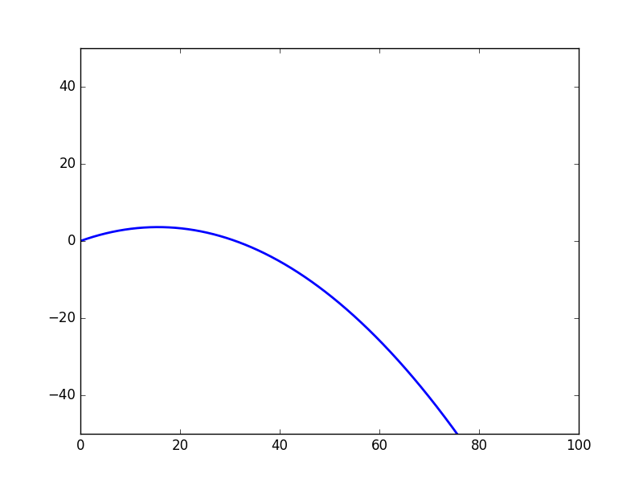
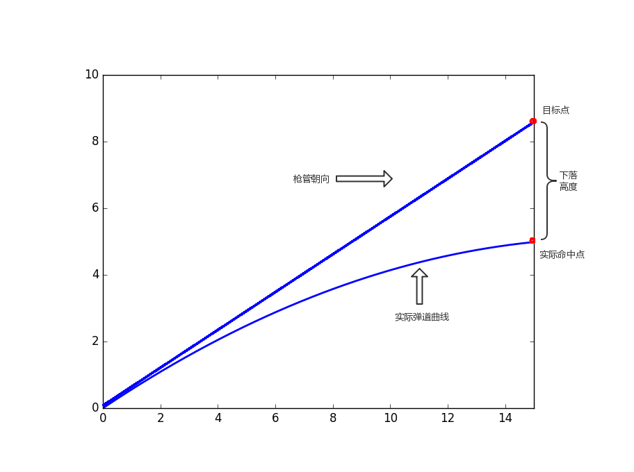

# 迭代弹道模型

* 2019.1.3 by Zhenpeng Ge,  zhenpeng.ge@qq.com

## 一、前言

​    在RoboMaster比赛中，子弹飞行模型对于命中率具有一定影响，对于远距离打击，如果不进行弹道修正，由于存在重力下落，子弹会打到目标偏下的位置。

   在目前的弹道研究，多针对于实际的炮弹，或枪弹模型，考虑因素非常多，模型相对精确，也相对复杂，基本上射击微分方程的数值求解，对于实时性影响较大。

​    在本文中，先提出一个简单的理想抛物线模型，然后加入空气阻力的考虑，并对模型进行简化，建立一个单方向空气阻力模型。

## 二、理想抛物线模型

* 只考虑重力对弹道的影响，理想弹道如下，是一条抛物线。



**现在给定目标位置坐标(x,y)，求解出射角（炮台仰角）。**

* 抛物线模型是非常简单的，给出枪口仰角，子弹初速度，很容易计算它的落点。
* 但是给定落点，求解出射角度是子弹运动的逆运算，需要反推模型，其结果是可以推算出的，其优点是求解精确，但公式复杂，且存在多解，无解的情况，编程也不太方便。

基于以上考虑，这里给出了一个**基于模型前向迭代的数值解法**：

首先引入几个概念：

* 



显然，当我们直接瞄准目标点（枪管朝向目标点）时，会有一个下落高度。

* 我们将利用这个**下落高度**进行迭代**补偿**。

***

算法过程如下：

* 设置最终目标点targetPoint

* 设临时目标点tempPoint=tempPoint

* 循环迭代10次：

  * 计算仰角angle=枪管指向tempPoint的角度

  * 利用抛物线模型，计算实际命中点realPoint.
  * 得到误差，即下落高度deltaH=targetPoint-realPoint
  * 更新tempPoint=tempPoint+deltaH

* 输出仰角angle，与误差deltaH

***

> 非常类似机器学习中的迭代过程，调整参数，使得tempPoint趋近于targetPoint

根据算法过程，编写代码进行测试，结果如下：

```bash
枪口速度25.000000,目标坐标（10.000000,1.000000）
---------------------------
第1次迭代: 仰角：5.710593,临时目标点y值:1.791840,高度误差:0.791840
第2次迭代: 仰角：10.158681,临时目标点y值:1.809172,高度误差:0.017332
第3次迭代: 仰角：10.254868,临时目标点y值:1.809661,高度误差:0.000489
第4次迭代: 仰角：10.257582,临时目标点y值:1.809675,高度误差:0.000014
第5次迭代: 仰角：10.257658,临时目标点y值:1.809675,高度误差:0.000000
第6次迭代: 仰角：10.257661,临时目标点y值:1.809675,高度误差:0.000000
第7次迭代: 仰角：10.257661,临时目标点y值:1.809675,高度误差:0.000000
第8次迭代: 仰角：10.257661,临时目标点y值:1.809675,高度误差:0.000000
第9次迭代: 仰角：10.257661,临时目标点y值:1.809675,高度误差:0.000000
第10次迭代: 仰角：10.257661,临时目标点y值:1.809675,高度误差:0.000000
---------------------------
最终结果:10.257661,最终误差:0.000000
```

测试结果：

* 最终误差小于1mm（目标在30m以内），满足精度需求.
* 在6代i7cpu上测试，时间小于0.1ms，满足实时性需求
* 目标距离越近，收敛速度越快，5m目标，3次迭代，就能达到误差小于1mm。

以上均为理想模型，未考虑空气阻力，并不能在实际中应用。（未实际测试）

## 三、单方向空气阻力模型

​    由于抛物线模型过于简单，所以实际应用场景并不多，但是抛物线模型是其他所有弹道模型的基础。这里我们考虑空气阻力，进一步修正模型，使得模型可以实际应用。

​    目前，已经存在许多先进的弹道模型，但是模型过于复杂，不易理解，而且涉及微分方程数值求解，比较耗时，所以，引入空气阻力模型，但本着简化模型的原则，对其进行简化。

*  由于在比赛中，子弹飞行不会过于斜抛（吊射基地除外），所以子弹飞行过程中，受到的阻力更多来源与水平方向（x方向）。
*  __假设空气阻力与速度平方成正比__

$$
\begin{align}\text{空气阻力模型 :  }&f=k_0v^2 \\
\text{ x方向:  }&f_x=f\cdot cos\theta=k_0v^2 \cdot cos\theta\\
\text{ y方向:  }&f_y=f\cdot sin\theta=k_0v^2\cdot sin\theta\\ 
\end{align}
$$

* cos(10°) =0.984 , sin(10°) =0.173
* 即10度以内，x方向承担较大的阻力分量,故考虑忽略y方向的阻力，当角度较小时，做如下假设：

$$
\begin{align}假设\theta 较小 :&cos\theta\approx1 \\
\text{ x方向:  }&f_x=f\cdot cos\theta=k_0v^2 \cdot cos\theta = k_0v^2 \cdot cos^2\theta=k_ov^2_x \\

\end{align}
$$


基于以上分析，**对子弹飞行做运动分解，只考虑水平方向的空气阻力**，不考虑垂直方向的空气阻力。

__x方向运动模型推导：__


$$
\begin{align}
\text{空气阻力模型 :  }&f_x=k_0v_x^2 \\
\text{ 牛顿定律:  }&-f_x/m=a=\frac{dv_x}{dt} \\
 &  \Longrightarrow  -\frac{k_0}{m}v_x^2 =\frac{dv_x}{dt} \Rightarrow k_1dt=-\frac{dv_x}{v_x^2} \dots\dots(k_1=\frac{k_0}{m}) \\
 &  \Longrightarrow k_1t+C=\frac{1}{v_x} \\
 &由v_x(t=0)=v_{x0}得：C=\frac{1}{v_{x0}} \\

即得到水平方向速度模型& v_x=\frac{v_{x0}}{k_1v_{x0}t+1} \\
即得到水平方向位移模型& x=\int^t_0v_xdt=\frac{1}{k_1}\ln(k_1v_{x0}t+1)
  \end{align}
$$


不难发现，当**阻力系数k1趋近于0**时，该模型**退化**为**理想抛物线模型**

$$
\lim_{k_1\rightarrow0}x=\lim_{k_1\rightarrow0}\frac{\ln(k_1v_{x0}t+1)}{k_1}=\lim_{k_1\rightarrow0}\frac{k_1v_{x0}t}{k_1}=\lim_{k_1\rightarrow0}v_{x0}t=v_{x0}t
$$
得到**运动模型**后，利用**基于模型前向迭代的数值解法** ，对模型进行迭代求解，步骤同上。

以下是阻力系数k1=0.1时的迭代结果

```bash
枪口速度25.000000,目标坐标（10.000000,1.000000）
---------------------------
第1次迭代: 仰角：5.710593,临时目标点y值:2.619620,高度误差:1.619620
第2次迭代: 仰角：14.679461,临时目标点y值:1.591977,高度误差:-1.027643
第3次迭代: 仰角：9.045448,临时目标点y值:2.229931,高度误差:0.637954
第4次迭代: 仰角：12.570891,临时目标点y值:1.828138,高度误差:-0.401793
第5次迭代: 仰角：10.360058,临时目标点y值:2.078997,高度误差:0.250858
第6次迭代: 仰角：11.744473,临时目标点y值:1.921498,高度误差:-0.157499
第7次迭代: 仰角：10.876800,临时目标点y值:2.020041,高度误差:0.098544
第8次迭代: 仰角：11.420302,临时目标点y值:1.958250,高度误差:-0.061791
第9次迭代: 仰角：11.079740,临时目标点y值:1.996943,高度误差:0.038693
第10次迭代: 仰角：11.293093,临时目标点y值:1.972693,高度误差:-0.024250
第11次迭代: 仰角：11.159414,临时目标点y值:1.987884,高度误差:0.015191
第12次迭代: 仰角：11.243165,临时目标点y值:1.978365,高度误差:-0.009518
第13次迭代: 仰角：11.190692,临时目标点y值:1.984328,高度误差:0.005963
第14次迭代: 仰角：11.223567,临时目标点y值:1.980592,高度误差:-0.003736
第15次迭代: 仰角：11.202970,临时目标点y值:1.982933,高度误差:0.002341
第16次迭代: 仰角：11.215874,临时目标点y值:1.981466,高度误差:-0.001466
第17次迭代: 仰角：11.207790,临时目标点y值:1.982385,高度误差:0.000918
第18次迭代: 仰角：11.212854,临时目标点y值:1.981809,高度误差:-0.000576
第19次迭代: 仰角：11.209682,临时目标点y值:1.982170,高度误差:0.000361
第20次迭代: 仰角：11.211669,临时目标点y值:1.981944,高度误差:-0.000226
---------------------------
最终结果:22.423358,最终误差:-0.000226
```

* 相对无空气阻力模型，有一个1度的角度修正。
* 该模型相对复杂，在收敛过程中会引入振荡，需要更多的迭代次数，保证收敛精度，即误差小于1mm（这里选择20次迭代）。

#### c.该模型适用场景

* 适用于远距离，即在抛物线下降沿打中目标，否则，会造成反效果。

## 四、单方向空气阻力模型参数K求解

理论上，获取一次测量数据，包括水平位移x，竖直位移y，仰角a，速度v。既可以求解参数k，但由于方程包含超越函数，无法直接求解。这里同样利用**基于模型前向迭代**给出数值解法。

- 计算初始k0
- 设临时k=k0
- 循环迭代200次：
  - 利用抛物线(含空气阻力)模型，计算临时命中点tempPoint（竖直位移tempY）.
  - 得到误差，即下落高度deltaH=realY-tempY.
  - 更新k=k-alpha*deltaH; (alpha为收敛速度系数，不易太大，过大会导致不收敛)
- 输出k，与误差deltaH

**k0计算：**

* 采用线性近似解

$$
\begin{align}
&
\begin{cases}
x=\frac{1}{k}\ln(kv_{x0}t+1)& \dots(1)\\
y=v_{y0}t-\frac{1}{2}gt^2   &\cdots(2)
\end{cases} \\
\\
&
\begin{cases}
e^{kx}=kv_{x0}t+1& \dots(1)\\
t=\frac{v_{y0}+\sqrt{v_{y0}^2-2gy}}{g}  &\cdots(3)
\end{cases} \\
&
(1) \Longrightarrow
1+kx+\frac{1}{2}k^2x^2\approx kv_{x0}t+1 &\cdots(4) \\
&
(4)\Longrightarrow
k\approx \frac{2( v_{x0}t-x)}{x^2} &\cdots(5)\\
  \end{align}
$$

即，把（1）带入（5）即可得到k的近似解。

注意：

* (1)->(4)：采用二阶泰勒展开近似exp(x)。
* (3)：时间取二元一次方程的最大值，即射击点应在抛物线的下落段。故在取点时，应考虑尽可能远（大于5m）

## 五、完全空气阻力模型

基于单方向空气阻力模型，我们进一步分析，考虑x,y两个方向的空气阻力，对模型进行一些简化，方便进行模型求解。

### a. 模型假设：

有了单方向模型推导的经验，我们依然__假设空气阻力与速度平方成正比__ 。
$$
\begin{align}
\text{空气阻力模型 :  }&f=k_0v^2 \\
\text{ x方向:  }&f_x=f\cdot cos\theta=k_0v^2 \cdot cos\theta\\
\text{ y方向:  }&f_y=f\cdot sin\theta=k_0v^2\cdot sin\theta\\
  \end{align}
$$
显然，fx与fy与子弹飞行的姿态有关，x,y方向运动并不能完全分解，为了简化计算过程，故做以下假设

__空气阻力假设:__
$$
\begin{align}
\text{ x方向:  }&\hat{f_x}=f_x\cdot cos\theta= k_0v^2\cdot cos^2\theta =k_0v^2_x<f_x\\
\text{ y方向:  }&\hat{f_y}=f_y\cdot sin\theta= k_0v^2\cdot sin^2\theta =k_0v^2_y<f_y\\
  \end{align}
$$

有了以上假设，就可以进行运动分解，两个方向单独计算，x方向还是和单方向空气阻力推导过程一样，只需要完成对y方向的模型推导即可。

### b. y方向运动模型推导：

对于y方向的阻力，如果弹道轨迹上升到抛物线最高点，空气阻力方向会发生改变，故这里为简化计算，__假设y方向上升过程，存在空气阻力，下降过程无空气阻力。__ 基于以下因素：

- 上升段，y方向空气阻力阻碍物体上升，表现为负补偿，需要加大补偿力度，下降段，阻碍物体下降，为正补偿作用。这里的正补偿作用可以补偿之前忽悠掉的其他因素。
- 且下降过程速度相对较小，优先射击点在上升段，以及下降过程较短等因素

__(1)上升过程：__
$$
\begin{align}
\text{空气阻力模型 :  }&f_y=k_0v_y^2 \\
\text{ 牛顿定律:  }&-f_y-mg=ma=m\frac{dv_y}{dt} \\
 &  \Longrightarrow  -\frac{k_0}{m}v_y^2-g =\frac{dv_y}{dt} \Rightarrow -dt=\frac{dv_x}{k_1v_x^2+g} \dots\dots(k_1=\frac{k_0}{m}) \\
 &  \Longrightarrow -t+C=\frac{1}{\sqrt{k_1g}} arctan(\sqrt{\frac{k_1}{g}}v_y)\\
 & 由v_y(t=0)=v_{y0}得C=\frac{1}{\sqrt{k_1g}} arctan(\sqrt{\frac{k_1}{g}}v_{y0})\\

即得到竖直方向速度模型& v_y=\sqrt{\frac{g}{k_1}}tan\left(\sqrt{k_1g}({C-t)}\right) \cdots\cdots(t<C)\\
即得到竖直方向位移模型& y=\int^t_0v_ydt=\frac{1}{k_1} \int^{\sqrt{k_1g}C}_{\sqrt{k_1g}(C-t)}tan(z)dz=\frac{1}{k_1}\cdot \ln{\frac{cos(\sqrt{k_1g}(C-t))}{cos(\sqrt{k_1g}C)}} \cdots(0<t<C)\\
特别，到达最高点有&y_{max}=\frac{1}{k_1} \cdot\ln{\frac{1}{cos(\sqrt{k_1g}C)}}=\frac{1}{2k_1}\ln(1+\frac{k_1}{g}v^2_{y0})\cdots(t=C)
  \end{align}
$$
__(2)下降过程：__
$$
y=-\frac{1}{2}gt^2
$$
__(3)空气阻力补偿:__

在子弹飞行上升过程中，由于速度角度（速度与水平夹角）是逐渐减少的，趋近于0。
$$
\begin{align}
速度夹角：&\theta\rightarrow0,则sin\theta\rightarrow0,cos\theta\rightarrow1 \\
\text{ x方向:  }&\hat{f_x}=f_x\cdot cos\theta \rightarrow f_x\\
\text{ y方向:  }&\hat{f_y}=f_y\cdot sin\theta  \rightarrow 0\\
&而且，\theta一般不会太大，大部分情况有：0<\theta<\frac{\pi}{4};
  \end{align}
$$


所以，x方向无需补偿，y方向需要进行空气阻力补偿，以减小模型误差，这里补偿
$$
\begin{align}
&\text{ y方向:  }\hat{f_y}=f_y\cdot sin\theta\cdot\frac{1}{sin\alpha} \\
&其中\alpha为射击初始角度\theta_0,这里把系数\frac{1}{sin\alpha}与k和并得：\\
&\hat{k_1}=k_1*\frac{1}{sin\alpha} (\alpha>0)
\end{align}
$$
即，对y方向，进行空气阻力系数补偿。

__k1求解方式：__

* __数值求解__：利用一次测试数据，求解参数k1。参考单方向空气阻力模型k迭代求解法。
* __经验求解__：不断调整k1，取得相对合适的值。
* __理论求解__：k1=k0/m；利用物理理论求解空气阻力系数k0（f=k0*v^2），即可得到k1.

### c. 最终混合模型

事实上，仅仅单独考虑两个方向的空气阻力是不够的，因为空气阻力不一定就是负作用，也可能产生正作用。

子弹方向过程中，可分别考虑上升段和下降端。

* 推导略


